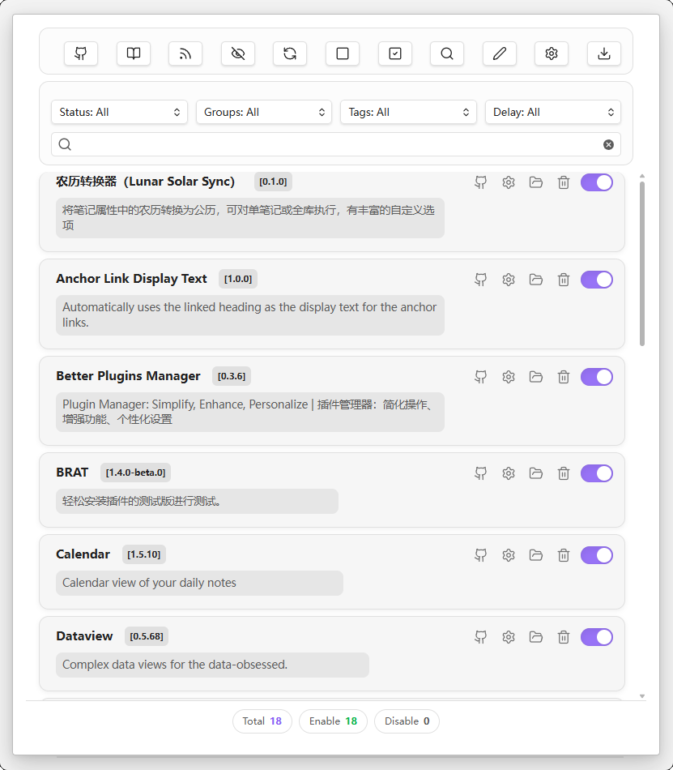
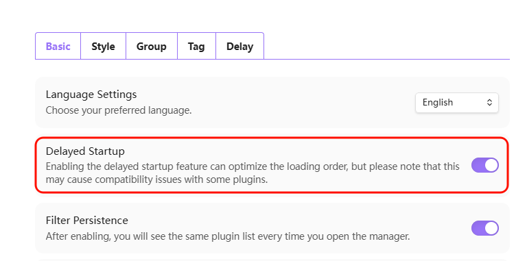
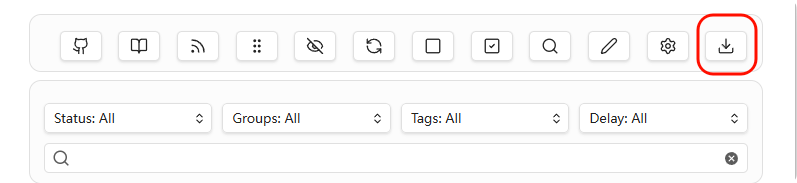
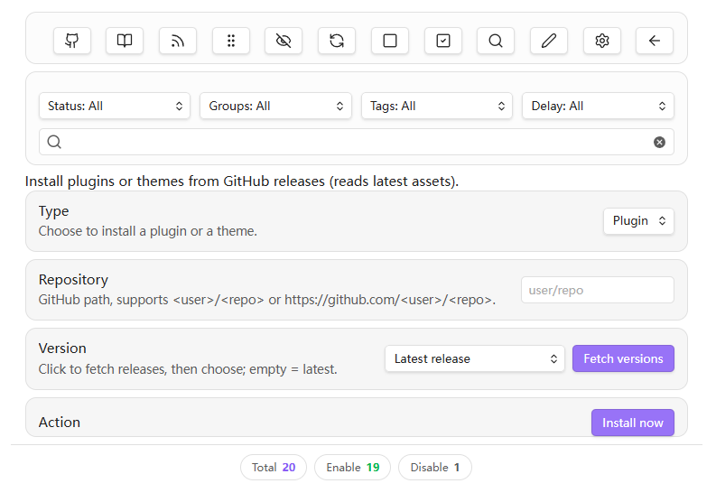
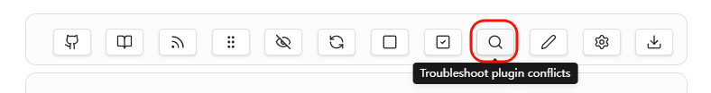
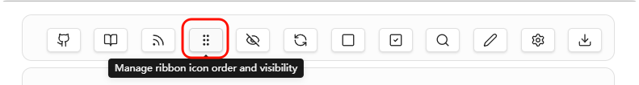

# Better Plugins Manager

[English](../README.md)




---

## 🎯 BPM 是什么？

**Better Plugins Manager** 是一款功能强大的 Obsidian 插件管理器，提供比原生更丰富的管理体验。

> 延迟启动 • 批量操作 • 分组标签 • GitHub 安装 • 冲突排查 • 移动友好

---

## ✨ 核心功能

### 🚀 延迟其他插件启动以优化Obsidian启动速度

此功能需要在设置中打开，默认关闭


| 功能 | 说明 |
|------|------|
| **延迟启动** | 按预设延迟启动插件，缓解启动卡顿 |


### 📦 批量管理
| 功能 | 说明 |
|------|------|
| **一键全开/全关** | 快速切换所有插件状态 |
| **分组操作** | 按分组批量启用/禁用 |
| **快速搜索** | 按状态、分组、标签、延迟、关键字筛选 |

### 🏷️ 整理与标注
| 功能 | 说明 |
|------|------|
| **自定义名称** | 给插件起个好记的名字 |
| **备注描述** | 记录插件用途和配置说明 |
| **分组标签** | 灵活分类，BPM 安装自动打 `bpm-install` 标签 |

### 📥 从 GitHub 安装未上架插件

1. 
2. 

| 功能 | 说明 |
|------|------|
| **仓库安装** | 支持 `user/repo` 或完整 URL |
| **版本选择** | 像 BRAT 一样选择发行版 |
| **仓库跳转** | 插件卡片一键跳转 GitHub |

### 🔍 冲突排查 🆕



| 功能 | 说明 |
|------|------|
| **二分法定位** | 快速定位问题插件或冲突对 |
| **向导式操作** | 可拖动悬浮窗，边操作边测试 |
| **生成报告** | 输出 Markdown 格式排查报告 |

### ↕ 自定义ribbon栏 🆕

如果你曾经因为bpm延迟启动插件而烦恼ribbon图标每次启动后顺序都会变化，请使用这个功能

1. 
2. 

| 功能 | 说明 |
|------|------|
| **显示隐藏ribbon** | 自定义 ribbon 栏每个图标的显示/隐藏 |
| **自定义ribbon排序** | 通过拖动自定义 ribbon 栏每个图标的排序 |

### 📱 移动端适配
| 功能 | 说明 |
|------|------|
| **响应式布局** | 自动切换移动/桌面布局 |
| **可折叠操作栏** | 节省屏幕空间 |
| **长按提示** | 触摸友好的交互体验 |

---

## 📦 安装方式

### 方式一：官方市场（推荐）
1. 打开 Obsidian 设置 → 第三方插件
2. 搜索 "Better Plugins Manager"
3. 点击安装并启用

### 方式二：手动安装
1. 下载 [最新 Release](https://github.com/zenozero-dev/obsidian-manager/releases)
2. 解压到 `.obsidian/plugins/better-plugins-manager/`
3. 重启 Obsidian 并启用

---

## 🚦 快速开始

### 打开管理器

- 点击侧边栏 📁 图标
- 或使用命令面板：`Ctrl/Cmd + P` → "打开插件管理面板"

面板分为三个区域，从上到下依次为：

1. 操作按钮区
2. 筛选搜索区
3. 插件列表区

### 操作说明
- **左键** 与元素互动，光标悬停在按钮上时会显示提示
- **右键** 打开二级菜单

---

## 🔍 插件冲突排查

当遇到插件冲突导致的问题时，使用冲突排查向导：

### 使用方法
1. 点击工具栏 🔍 按钮或使用命令 "排查插件冲突"
2. 按照向导提示操作
3. 每步测试问题是否存在，点击对应按钮
4. 自动定位到问题插件或冲突对

### 支持的场景
- **单插件问题**：某个插件自身有 bug
- **双插件冲突**：两个插件单独没问题，一起用才冲突

### 操作提示
- 悬浮窗可拖动，方便边测试边操作
- 支持撤销上一步
- 排查状态会保存，重启后可继续

---

## ⚙️ 启动自检

BPM 启动时会检测 `community-plugins.json`：

| 情况 | 处理 |
|------|------|
| 只有 BPM | 正常启动 |
| 有其他插件 | 弹窗提示接管 |

### 为什么需要接管？
- 避免 Obsidian 和 BPM 同时控制插件
- 确保延迟启动等功能正常工作
- 保持插件状态一致性

---

## 📤 导出到 Obsidian Base

### 配置
在设置中填写 **插件信息导出目录**（库内文件夹）

### 规则
| 前缀 | 权限 |
|------|------|
| `bpm_rw_*` | 可读写 |
| `bpm_ro_*` | 只读 |
| `bpm_rwc_repo` | 条件可写 |

### Frontmatter 示例

```yaml
---
bpm_ro_id: some-plugin
bpm_rw_name: 自定义名
bpm_rw_desc: 自定义描述
bpm_rw_note: 备注
bpm_rw_enabled: true
bpm_rwc_repo: user/repo
bpm_ro_group: group-id
bpm_ro_tags:
  - tag-a
  - bpm-install
bpm_ro_delay: delay-id
bpm_ro_installed_via_bpm: true
---

正文区：这里的内容可自行编辑或替换。
```

---

## ⚙️ 设置说明

| 设置项 | 说明 |
|--------|------|
| 延迟预设 | 创建延迟配置并分配给插件 |
| 隐藏 BPM 标签 | 保留自动标签但在界面中隐藏 |
| GitHub API Token | 提升发行版拉取的速率上限 |
| 淡化未启用插件 | 未启用的卡片视觉弱化 |
| 导出提示文案 | 自定义导出文件的正文提示 |
| 自检提醒 | 控制启动自检弹窗是否显示 |

---

## ⌨️ 命令列表

| 命令 | 说明 |
|------|------|
| 打开插件管理面板 | 打开 BPM 主界面 |
| 排查插件冲突 | 🆕 启动冲突排查向导 |
| 启用/禁用 [插件名] | 单插件开关（需在设置中启用） |
| 启用/禁用 [分组名] | 分组批量操作（需在设置中启用） |

---

## 📱 兼容性

| 平台 | 支持 |
|------|------|
| Windows / macOS / Linux | ✅ |
| Android | ✅ |
| iOS / iPadOS | ✅ |

插件会自动按平台切换桌面/移动布局。

---

## 🤝 参与贡献

欢迎提交 Issue 和 PR！

- **Bug 反馈**：请附日志和复现步骤
- **功能建议**：可先开讨论或 Issue

## 🙏 致谢

- ribbon排序功能参考了 [Obsidian-ribbon-sort](https://github.com/zenozero-dev/obsidian-ribbon-sort)

---

## 📄 许可

[MIT](../LICENSE)
