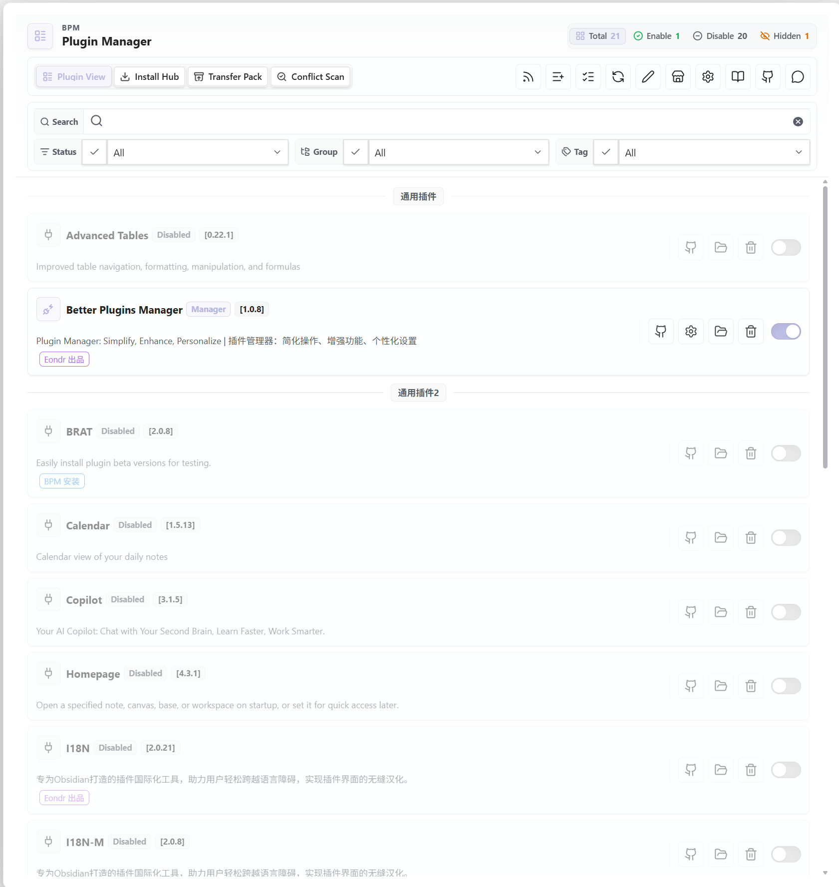
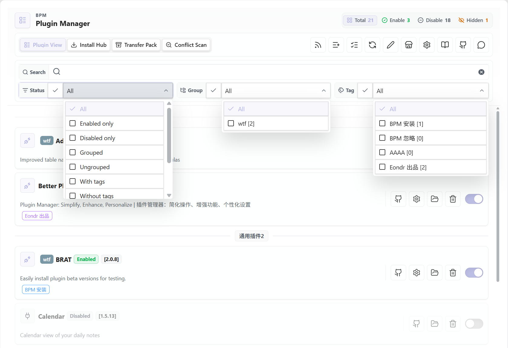
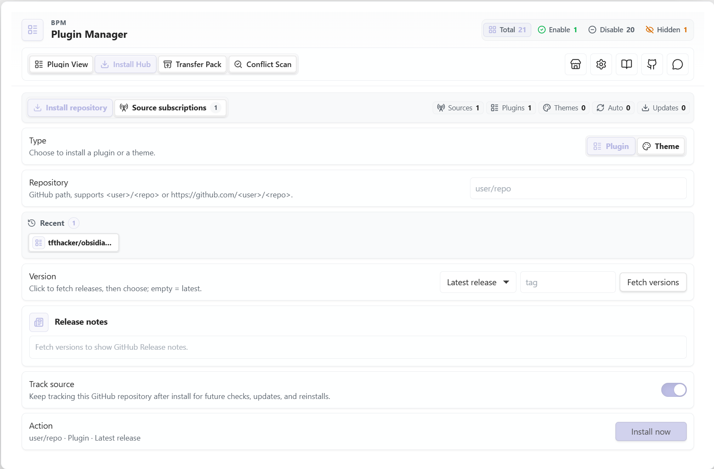
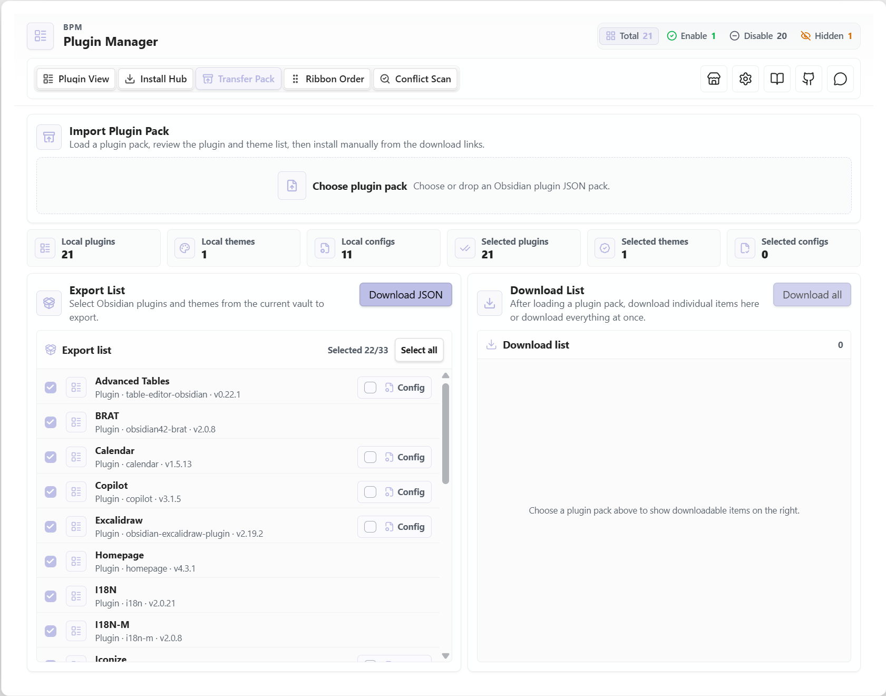
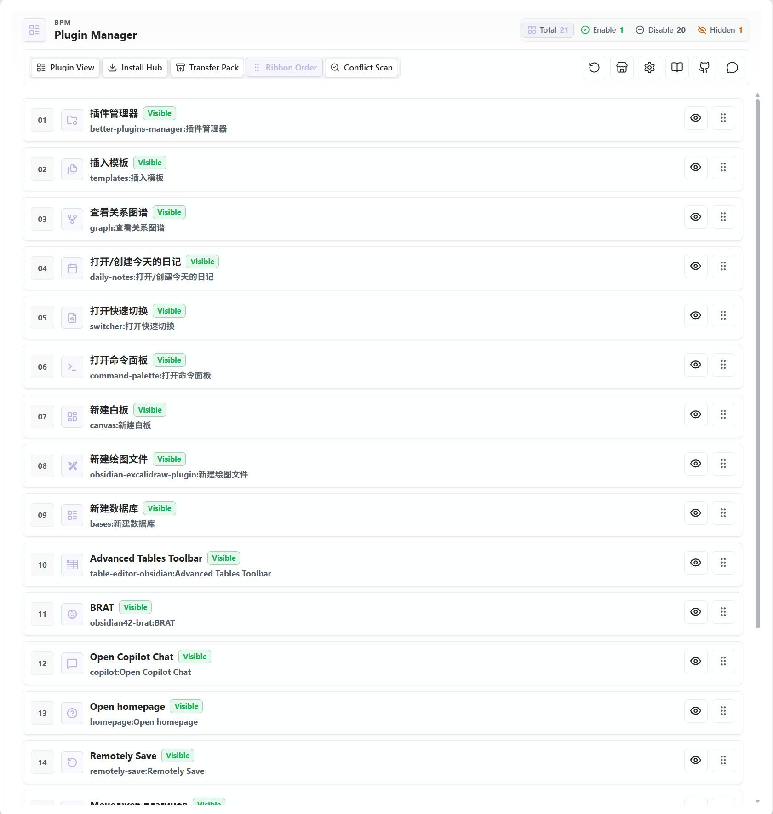
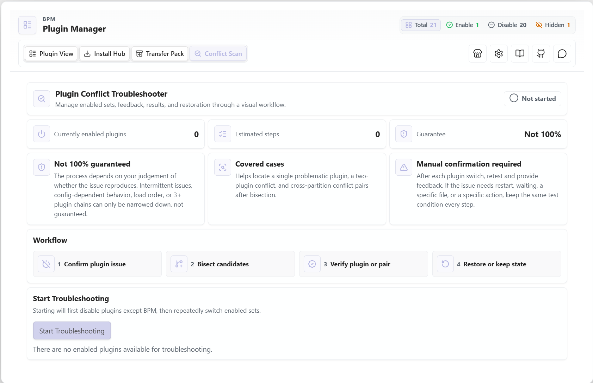

# Better Plugins Manager

**Obsidian のための、より高機能なプラグインマネージャー。**

多数のプラグインを使う Obsidian vault を、遅延起動、バッチ操作、グループとタグ、GitHub インストール、競合診断で管理しやすくします。

  <a href="../README.md">English</a>
  ·
  <a href="README_CN.md">简体中文</a>
  ·
  <a href="README_KO.md">한국어</a>
  ·
  <a href="README_ES.md">Español</a>
  ·
  <a href="README_FR.md">Français</a>
  ·
  <a href="README_RU.md">Русский</a>
  ·
  <a href="https://github.com/eondrcode/obsidian-manager/releases">Releases</a>
  ·
  <a href="https://ifdian.net/a/eondr">Support</a>

  
  
  
  
  
  

  
  
  
  
  
  
  

---

## 🎯 BPM とは？

**Better Plugins Manager (BPM)** は Obsidian コミュニティプラグインのコントロールセンターです。多くのプラグインに依存し、単純な有効/無効切り替え以上の管理が必要な vault 向けに設計されています。

起動の応答性を保ち、ワークフローごとにプラグインを整理し、GitHub Release からインストールし、問題が起きたときに競合を切り分けられます。

| 🚀 起動 | 📦 管理 | 🏷️ 整理 | 📥 インストール | 🔍 診断 |
|--------|--------|----------|-----------------|---------|
| プラグインの遅延起動と起動時セルフチェック | 一括有効/無効、クイック検索、状態フィルター | グループ、タグ、メモ、説明、カスタム名 | GitHub リポジトリと Release からインストール | ガイド付き競合診断とレポート生成 |

---

## ✨ 主な機能

BPM は 5 つのタブを中心に構成されています。各タブが 1 つのワークフローを担当するため、関連する操作がまとまり、デスクトップでもモバイルでも見通しよく使えます。

| Tab | ワークフロー |
|-----|--------------|
| 🧩 Plugin View | インストール済みプラグイン、メタデータ、フィルター、起動動作、個別操作を管理 |
| 📥 Install Hub | GitHub からプラグインやテーマをインストールし、追跡ソースを管理 |
| 📦 Transfer Pack | vault 間でプラグイン/テーマパックをエクスポート、インポート、復元 |
| 🎛️ Ribbon Order | Obsidian の Ribbon アイコンの順序と表示を制御 |
| 🔍 Conflict Diagnosis | プラグイン問題を切り分け、診断レポートを生成 |

### 🧩 Plugin View

日常的なプラグイン管理のメインタブです。

| 項目 | 内容 |
|------|------|
| **プラグイン一覧** | インストール済みコミュニティプラグインをコンパクトで検索可能なビューで確認 |
| **一括操作** | プラグインをまとめて有効/無効化。グループ単位の操作にも対応 |
| **フィルター** | 有効状態、グループ、タグ、遅延設定、キーワードで絞り込み |
| **整理** | カスタム名、説明、メモ、グループ、タグを追加 |
| **起動制御** | 遅延起動プリセットを割り当て、一覧から起動状態を確認 |
| **プラグイン操作** | 更新確認、更新ダウンロード、再起動、一時起動、設定を開く、フォルダーを開く、ID コピー、リポジトリを開く、設定クリア、非表示、削除 |
| **BPM タグ** | BPM でインストールしたプラグインに `bpm-install` を自動付与し、`bpm-ignore` による除外にも対応 |

### 📥 Install Hub

Install Hub は GitHub からのインストールと、インストール後に BPM が追跡できるソースを扱います。

| 項目 | 内容 |
|------|------|
| **種類の切り替え** | プラグインとテーマのインストールを切り替え |
| **リポジトリ入力** | `user/repo` または完全な GitHub リポジトリ URL に対応 |
| **Release 選択** | GitHub Release を取得し、最新版または指定バージョンをインストール |
| **Release notes** | 利用可能な場合、インストール前に Release 情報を表示 |
| **最近使った項目** | 最近使用したリポジトリを保存し、再インストールを高速化 |
| **ソース追跡** | インストール済みリポジトリを追跡し、後の確認、更新、再インストールに利用 |
| **ソース管理** | 追跡中のプラグイン/テーマソース、更新対象、再インストール項目、ソースメタデータを管理 |

### 📦 Transfer Pack

Transfer Pack は vault 間でプラグイン構成を移動するための機能です。手動のチェックリストを作る必要はありません。

| 項目 | 内容 |
|------|------|
| **エクスポート一覧** | ローカルのプラグインとテーマを選択して JSON 転送パックを作成 |
| **プラグイン設定** | 必要なプラグイン設定ファイルを選択してエクスポート |
| **分類情報** | BPM のグループ、タグ、遅延プリセットをエクスポート |
| **レイアウト情報** | マネージャーの順序、非表示項目、Ribbon レイアウトをエクスポート |
| **ソース情報** | GitHub リポジトリマップ、ソース購読、インストール履歴をエクスポート |
| **ワークスペース設定** | スタイル、遅延モード、タグ表示、起動時チェック設定をエクスポート |
| **インポートプレビュー** | 適用前にプラグイン、テーマ、ソース、設定、レイアウトを確認 |
| **復元オプション** | 不足プラグイン/テーマのインストール、設定のマージ、有効状態の復元、レイアウト適用、ソースのマージ、テーマのインポート |

### 🎛️ Ribbon Order

Ribbon Order は Obsidian 左側 Ribbon の順序を安定させます。特に遅延起動プラグインが起動後にアイコンを登録する場合に役立ちます。

| 項目 | 内容 |
|------|------|
| **アイコン順序** | Ribbon 項目をドラッグして安定した順序に並べ替え |
| **表示制御** | 個別の Ribbon アイコンを表示または非表示 |
| **Native Sync Mode** | Obsidian workspace 設定ではなく BPM データに Ribbon レイアウトを保存 |
| **リセット** | すべての Ribbon 項目を表示し、名前順に並べ替え |
| **リロード案内** | 起動時に非表示だったアイコンの表示に Obsidian のリロードが必要な場合に通知 |

### 🔍 Conflict Diagnosis

Conflict Diagnosis はプラグイン競合のテストを段階的に案内し、テスト状態と結果を 1 か所に保持します。

| 項目 | 内容 |
|------|------|
| **事前確認** | 他のプラグインを無効化しても問題が残るか確認 |
| **二分絞り込み** | 分割テストで疑わしいプラグイン群を縮小 |
| **競合ペア探索** | 2 プラグイン間の競合を特定。グループをまたぐケースにも対応 |
| **手動フィードバック** | 各ステップで問題が残るかどうかをユーザーが確認 |
| **状態操作** | 前の手順に戻る、Obsidian を再起動、診断終了、元の状態に復元、現在の状態を維持 |
| **結果レポート** | 検出されたプラグインと推奨対応を含む Markdown レポートを生成 |

---

## 📦 インストール

### Community Plugins

ほとんどのユーザーに推奨します。

1. **Obsidian Settings → Community Plugins** を開きます。
2. **Better Plugins Manager** を検索します。
3. インストールして有効化します。

### 手動インストール

GitHub Release を直接インストールしたい場合に使います。

1. [latest release](https://github.com/eondrcode/obsidian-manager/releases) をダウンロードします。
2. `main.js`、`manifest.json`、`styles.css` を `.obsidian/plugins/better-plugins-manager/` にコピーします。
3. Obsidian を再起動します。
4. **Settings → Community Plugins** から **Better Plugins Manager** を有効化します。

---

## 🚦 クイックスタート

### BPM を開く

プラグインを有効化した後、次のどちらかで BPM を開けます。

- 左側 Ribbon の BPM アイコンをクリックします。
- コマンドパレットから **Open the plugin manager** を実行します。

### 最初の手順

1. **Plugin View** でインストール済みプラグイン、フィルター、グループ、タグ、遅延設定を確認します。
2. GitHub からプラグインやテーマをインストールするときは **Install Hub** を使います。
3. vault 間で構成を移動するときは **Transfer Pack** を使います。
4. プラグイン問題を切り分けるときは **Conflict Diagnosis** を使います。

### 操作のヒント

- **左クリック** で切り替え、編集、インストール、インポート、操作実行を行います。
- **右クリック** でプラグイン項目のコンテキストメニューを開きます。
- ツールバーのボタンに **ホバー** すると説明が表示されます。タッチ端末では対応箇所で長押しを使えます。

---

## セキュリティと開示

BPM はローカルの Obsidian プラグインマネージャーですが、一部の機能では外部サービスやブラウザ API を意図的に使用します。

- **外部ネットワークリクエスト**: BPM は、コミュニティプラグインのメタデータ取得、リポジトリ解決、release 確認、GitHub からのプラグイン/テーマのインストールや更新など、ユーザーに見えるプラグイン管理機能でのみ GitHub に接続します。これらのリクエストでは `github.com`、`api.github.com`、`raw.githubusercontent.com` を使用する場合があります。また、ユーザーが関連ボタンをクリックした場合にのみ、`github.com` のリポジトリページと `www.bilibili.com` のプロジェクトチュートリアルを開きます。
- **クリップボードアクセス**: BPM は、ユーザーがプラグインの **Copy ID** をクリックした場合にのみシステムクリップボードへ書き込みます。
- **Vault ファイルアクセス**: BPM は、管理、移行、バックアップ、インポート/エクスポート、トラブルシューティングのために、プラグイン/テーマのメタデータ、選択されたプラグイン設定ファイル、Transfer Pack、legacy export フォルダを読み取ります。vault のノートをリモートサービスへアップロードすることはありません。
- **Base64 エンコード/デコード**: BPM は、ローカルの Transfer Pack JSON データ内でバイナリ/テキストファイルをパックおよび復元する目的でのみ、実行時に `btoa`/`atob` を使用します。API key、URL、リモートコード、実行可能 payload を隠すためには使用しません。
- **スキャン制限**: プラグインカタログまたは marketplace が malware、obfuscation、network scan を利用できないと表示する場合は、インストール前にこのリポジトリのソースコードと release assets を確認してください。BPM は意図的にソースを難読化しません。

---
## 🔍 Conflict Diagnosis チュートリアル

コミュニティプラグインを有効化した後に問題が発生し、原因を段階的に絞り込みたい場合に **Conflict Diagnosis** を使います。

### ワークフロー

1. **Conflict Diagnosis** タブを開くか、コマンドパレットから **Troubleshoot plugin conflicts** を実行します。
2. 診断セッションを開始します。BPM は変更前のプラグイン状態を記録します。
3. 各ステップ後に vault をテストし、**Problem Still Exists** または **Problem Gone** を選びます。
4. ガイド付き分割テストを続け、結果をプラグインまたはプラグインペアまで絞ります。
5. 結果を確認し、元の状態に戻すか現在の状態を維持し、必要に応じて Markdown レポートを生成します。

### 注意

- 診断は各ステップでのフィードバックに依存します。毎回同じ操作でテストしてください。
- 断続的な不具合、読み込み順の問題、設定依存の問題、3 つ以上のプラグインが関わる競合は手動確認が必要な場合があります。
- 前の手順に戻る、テスト中に Obsidian を再起動する、診断を終了する、元の状態に復元する、現在の状態を維持することができます。

---

## 🛡️ Startup Takeover

**Delayed Startup** が有効な場合、BPM は `.obsidian/community-plugins.json` を確認し、Obsidian と BPM が同じプラグインを同時に制御しないようにします。

| 状況 | BPM の動作 |
|------|------------|
| 未管理プラグインなし | 通常どおり起動 |
| 未管理プラグインを検出 | takeover プロンプトを表示 |
| Auto Takeover 有効 | 検出したプラグインを自動的に BPM 管理へ移行 |
| `bpm-ignore` が付いたプラグイン | Obsidian のネイティブ起動リストに残す |

Takeover により、遅延起動、有効状態、BPM のプラグイン記録を一貫させます。成功後は Obsidian を再起動し、起動リストをきれいに適用してください。

---

## 📦 Transfer と Legacy Export

現在のバージョンでは、vault 間で構成を移動する場合は **Transfer Pack** を使ってください。プラグイン一覧、テーマ、選択したプラグイン設定、グループ、タグ、遅延プリセット、レイアウト情報、Ribbon 順序、ソース購読、インストール履歴、ワークスペース設定をエクスポート/インポートできます。

古い Markdown/frontmatter の Obsidian Base export は、レガシーデータ互換のためだけに残されています。新しい構成では Base export フォルダーを設定せず、**Transfer Pack** を使ってください。

---

## ⚙️ 設定

BPM の設定は機能ごとに分かれています。

| ページ | 設定できる内容 |
|--------|----------------|
| **Basic** | 言語、フィルター保持、遅延起動、Auto Takeover、起動時更新チェック、ソース更新チェック、ソース自動更新、BPM タグ表示、Ribbon order、コマンド、デバッグモード、GitHub token |
| **Main Page Actions** | どのプラグイン操作をカード上に直接表示し、どれを右クリックメニューに入れるか |
| **Style** | プラグイン一覧レイアウト、項目表示スタイル、グループ/タグスタイル、無効プラグインのフェード表示 |
| **Groups** | プラグイングループの作成、名前変更、色変更、削除 |
| **Tags** | プラグインタグの作成、名前変更、色変更、削除 |
| **Delay** | 遅延起動プロファイルの作成と管理。遅延起動が有効な場合のみ表示 |

---

## ⌨️ コマンド

| コマンド | 利用条件 | 説明 |
|----------|----------|------|
| **Open the plugin manager** | 常に利用可能 | BPM メイン画面を開く |
| **Troubleshoot plugin conflicts** | 常に利用可能 | 競合診断ワークフローを開始 |
| **Enable/Disable [Plugin Name]** | 任意設定 | プラグインごとの直接切り替えコマンドを登録 |
| **One-click Enable/Disable [Group Name]** | 任意設定 | グループ単位の一括切り替えコマンドを登録 |

---

## 📱 互換性

| プラットフォーム | 対応 |
|------------------|------|
| Windows / macOS / Linux | ✅ |
| Android | ✅ |
| iOS / iPadOS | ✅ |

プラグインはプラットフォームに応じてデスクトップ/モバイルレイアウトを自動的に切り替えます。

---

## 🤝 コントリビューション

Issue と PR を歓迎します。

- **バグ報告**: ログと再現手順を含めてください。
- **機能要望**: まず discussion または issue を開くことをおすすめします。

## 🙏 謝辞

- Ribbon sorting 機能は [Obsidian-ribbon-sort](https://github.com/yunrr/Obsidian-app-ribbon-sorting) に着想を得ています。

---

## 📄 License

[MIT](../LICENSE)
